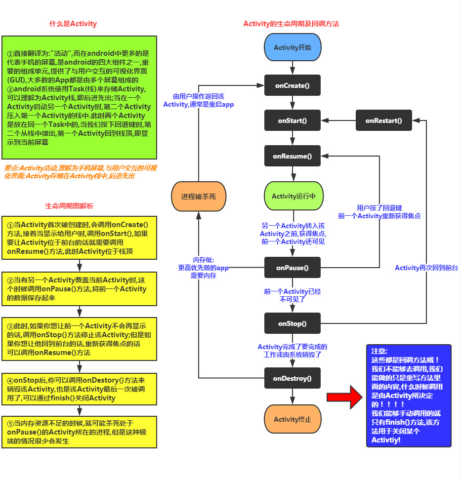

## Android 架构

Android 操作系统是一个软件组件的栈，在架构图中它大致可以分为五个部分和四个主要层。


### Linux内核

在所有层的最底下是 Linux - 包括大约115个补丁的 Linux 3.6。它提供了基本的系统功能，比如进程管理，内存管理，设备管理（如摄像头，键盘，显示器）。同时，内核处理所有 Linux 所擅长的工作，如网络和大量的设备驱动，从而避免兼容大量外围硬件接口带来的不便。

### 程序库

这个类别包括了专门为 Android 开发的程序库（基于 Java ）。这个类别程序库的示例包括应用程序框架库，如用户界面构建，图形绘制和数据库访问。一些 Android 开发者可用的 Android 核心程序库总结如下：

- android.app - 提供应用程序模型的访问，是所有 Android 应用程序的基石。
- android.content - 方便应用程序之间，应用程序组件之间的内容访问，发布，消息传递。
- android.database - 用于访问内容提供者发布的数据，包含 SQLite 数据库管理类。
- android.opengl - OpenGL ES 3D 图片渲染 API 的 Java 接口。
- android.os - 提供应用程序访问标注操作系统服务的能力，包括消息，系统服务和进程间通信。
- android.text - 在设备显示上渲染和操作文本。
- android.view - 应用程序用户界面的基础构建块。
- android.widget - 丰富的预置用户界面组件集合，包括按钮，标签，列表，布局管理，单选按钮等。
- android.webkit - 一系列类的集合，允许为应用程序提供内建的 Web 浏览能力。

看过了 Android 运行层内的基于 Java 的核心程序库，是时候关注一下 Android 软件栈中的基于 C/C++ 的程序库。

Android Runtime

这是架构中的第三部分，自下而上的第二层。这个部分提供名为 Dalvik 虚拟机的关键组件，类似于 Java 虚拟机，但专门为 Android 设计和优化。

Dalvik 虚拟机使得可以在 Java 中使用 Linux 核心功能，如内存管理和多线程。Dalvik 虚拟机使得每一个 Android 应用程序运行在自己独立的虚拟机进程。

Android 运行时同时提供一系列核心的库来为 Android 应用程序开发者使用标准的 Java 语言来编写 Android 应用程序。

### 应用框架

应用框架层以 Java 类的形式为应用程序提供许多高级的服务。应用程序开发者被允许在应用中使用这些服务。

- 活动管理者 - 控制应用程序生命周期和活动栈的所有方面。
- 内容提供者 - 允许应用程序之间发布和分享数据。
- 资源管理器 - 提供对非代码嵌入资源的访问，如字符串，颜色设置和用户界面布局。
- 通知管理器 - 允许应用程序显示对话框或者通知给用户。
- 视图系统 - 一个可扩展的视图集合，用于创建应用程序用户界面。

------

### 应用程序

顶层中有所有的 Android 应用程序。你写的应用程序也将被安装在这层。这些应用程序包括通讯录，浏览器，游戏等。


## Android 应用程序组件

应用程序组件是一个Android应用程序的基本构建块。AndroidManifest.xml描述了应用程序的每个组件，以及他们如何交互。

### 四个主要组件

| 组件                | 描述                                      |
| ------------------- | ----------------------------------------- |
| Activities          | 描述UI，并且处理用户与机器屏幕的交互。    |
| Services            | 处理与应用程序关联的后台操作。            |
| Broadcast Receivers | 处理Android操作系统和应用程序之间的通信。 |
| Content Providers   | 处理数据和数据库管理方面的问题。          |

#### Activities

一个活动标识一个单一屏幕。举个例子，一个邮件应用程序可以包含一个活动用于显示新邮件列表，另一个活动用来编写邮件，再一个活动来阅读邮件。当应用程序拥有多于一个活动，其中的一个会被标记为当应用程序启动时显示。

一个活动是**Activity**类的一个子类

```java
public class MainActivity extends Activity {
}
```

#### Services

服务是运行在后台，执行长时间操作的组件。举个例子，服务可以是用户在使用不同的程序时在后台播放音乐，或者在活动中通过网络获取数据但不阻塞用户交互。

一个服务是**Service**类的子类

```java
public class MyService extends Service {
}
```

#### Broadcast Receivers

广播接收器简单地响应从其他应用程序或者系统发来的广播消息。举个例子，应用程序可以发起广播来让其他应用程序知道一些数据已经被下载到设备，并且可以供他们使用。因此广播接收器会拦截这些通信并采取适当的行动。

广播接收器是**BroadcastReceiver**类的一个子类，每个消息以**Intent**对象的形式来广播。

```java
public class MyReceiver  extends  BroadcastReceiver {
}
```

#### Content Providers

内容提供者组件通过请求从一个应用程序到另一个应用程序提供数据。这些请求由**ContentResolver**类的方法来处理。这些数据可以是存储在文件系统、数据库或者其他其他地方。

内容提供者是**ContentProvider**类的子类，并实现一套标准的API，以便其他应用程序来执行事务。

```java
public class MyContentProvider extends  ContentProvider {
}
```

### 附件组件

有一些附件的组件用于以上提到的实体、他们之间逻辑、及他们之间连线的构造。这些组件如下：

| 组件      | 描述                                             |
| --------- | ------------------------------------------------ |
| Fragments | 代表活动中的一个行为或者一部分用户界面。         |
| Views     | 绘制在屏幕上的UI元素，包括按钮，列表等。         |
| Layouts   | 控制屏幕格式，展示视图外观的View的继承。         |
| Intents   | 组件间的消息连线。                               |
| Resources | 外部元素，例如字符串资源、常量资源及图片资源等。 |
| Manifest  | 应用程序的配置文件。                             |


## 开发入门

## 第一章

### UI设计（偏美工）

https://www.runoob.com/w3cnote/android-tutorial-interface-design.html


### 工程项目结构解析


- **java：**我们写Java代码的地方，业务功能都在这里实现
- **res：**存放我们各种资源文件的地方，有图片，字符串，动画，音频等，还有各种形式的XML文件

更多细节介绍：（详细请看教程）

图片资源：

- **drawable：**存放各种位图文件，(.png，.jpg，.9png，.gif等)除此之外可能是一些其他的drawable类型的XML文件
- **mipmap-hdpi：**高分辨率，一般我们把图片丢这里
- **mipmap-mdpi：**中等分辨率，很少，除非兼容的的手机很旧
- **mipmap-xhdpi：**超高分辨率，手机屏幕材质越来越好，以后估计会慢慢往这里过渡
- **mipmap-xxhdpi：**超超高分辨率，这个在高端机上有所体现

布局资源：

- **layout：**该目录下存放的就是我们的布局文件，另外在一些特定的机型上，我们做屏幕适配，比如480*320这样的手机，我们会另外创建一套布局，就行：layout-480x320这样的文件夹！

菜单资源：

* **menu：**在以前有物理菜单按钮，即menu键的手机上，用的较多，现在用的并不多，菜单项相关的资源xml可在这里编写，不知道谷歌会不会出新的东西来替代菜单了

### 深入了解三个文件：(大体了解下)

主源文件：MainActivity.java，

```java
//MainActivity.java：
package jay.com.example.firstapp;

import android.support.v7.app.AppCompatActivity;
import android.os.Bundle;

public class MainActivity extends AppCompatActivity {
    @Override
    protected void onCreate(Bundle savedInstanceState) {
        super.onCreate(savedInstanceState);
        setContentView(R.layout.activity_main);  //加载R.layout.activity_main
    }
}
```

布局文件：activity_main.xml    （在layout文件夹下）

Android配置文件：AndroidManifest.xml 

## 第二章UI组件

### View与ViewGroup的概念（大概了解即可）

所有的用户界面元素都是由View和ViewGroup的对象构成的。View是绘制在屏幕上的用户能与之交互的一个对象。而ViewGroup则是一个用于存放其他View（和ViewGroup）对象的布局容器！


大概了解即可，平时不用。

### 布局

Android中有六大布局,分别是: LinearLayout(线性布局)，RelativeLayout(相对布局)，TableLayout(表格布局) FrameLayout(帧布局)，AbsoluteLayout(绝对布局)，GridLayout(网格布局) 

**尽量使用RelativeLayout + LinearLayout的weight属性搭配使用**吧！主要学习前两个即可。

### TextView(文本框)详解

### EditText(输入框)详解

### Button(按钮)与ImageButton(图像按钮)

### RadioButton(单选按钮)&Checkbox(复选框)

### 开关按钮ToggleButton和开关Switch

### 菜单(Menu)


## 第三章事件处理机制

### 基于监听的事件处理机制


## 第四章四大组件

### Activity（活动）

**注意事项：**

1.onPause()和onStop()被调用的前提是： 打开了一个新的Activity！而前者是旧Activity还可见的状态；后者是旧Activity已经不可见！（有对话框式的活动）

2.另外，亲测：AlertDialog和PopWindow是不会触发上述两个回调方法的

3.onStart /onStop 从可见的角度回调的； 而onResume/onPasue 从是否位于前台的角度回调的。

总之，
onStart  可见不可点击   onResume 可见可点击；
onPause 可见不可点击（比如弹出对话框）onStop 不可见


多个Activity之间的切换举例：

从Activity1切换到Activity2时，先回调Activity1的onPause方法，然后调用Activity2的onCreate,onStart,onResume方法，然后回调Activity1的onStop方法。

如果点击back，先会调用先回调Activity2的onPause方法，然后调用Activity1的onRestart,onStart,onResume，最后调用Activity2的onStop方法和onDestroy方法。

切换的思想：

先onPause，是为了在进入新的Activity前中止掉前一个Activity的干扰（比如看视频时来了电话），

先调用新Activity的创建，再结束旧Activity。是为了在新的成功后才中止旧的。避免新的闪退而旧的早已结束变成黑屏。

Activity的横竖屏切换：

Activity的横竖屏切换会销毁掉旧的activity，重新创建新的activity

## Activity的创建流程


好了，上面也说过，可以继承Activity和AppCompatActivity，只不过后者提供了一些新的东西而已！ 另外，切记，Android中的四大组件，只要你定义了，无论你用没用，都要在AndroidManifest.xml对 这个组件进行声明，不然运行时程序会直接退出，报ClassNotFindException...*

### Activity的启动方式（显隐）

显式：

**①最常见的：**

```java
startActivity(new Intent(当前Act.this,要启动的Act.class));
```

②通过Intent的ComponentName：

```java
ComponentName cn = new ComponentName("当前Act的全限定类名","启动Act的全限定类名") ;
Intent intent = new Intent() ;
intent.setComponent(cn) ;
startActivity(intent) ;
```

③

初始化Intent时指定包名：

```java
Intent intent = new Intent("android.intent.action.MAIN");
intent.setClassName("当前Act的全限定类名","启动Act的全限定类名");
startActivity(intent);
```

隐式：**通过Intent-filter的Action,Category或data来实现**


### 活动的启动模式：

standrad,singleTop,singleTask,singleInstance,

通过指定android:launchMode来选择启动模式。

standrad不论活动是否已在返回栈存在，启动活动时都创建活动的一个新实例。


back键得回退2次才会回退到最初建的活动。


singleTop启动活动时，如果活动已在栈顶，则不创建活动的一个新实例。否则创建活动的一个新实例。

singleTask启动活动时，首先检查栈内是否存在活动实例，无则创建。有则直接使用该实例，并将该实例之上的其他活动通通出栈。

singleInstance创建一个新的返回栈，一般用于共享活动实例，比如程序的某些活动需要被其他程序共用。

## 系统给我们提供的常见的Activity

详见教程


### activity的深入和精通待定


## service

- **程序**：为了完成特定任务，用某种语言编写的一组指令集合(一组**静态代码**)
- **进程**：**运行中的程序**，系统调度与资源分配的一个**独立单位**，操作系统会 为每个进程分配一段内存空间！程序的依次动态执行，经历代码的加载，执行， 执行完毕的完整过程！
- **线程**：比进程更小的执行单元，每个进程可能有多条线程，**线程**需要放在一个 **进程**中才能执行，**线程由程序**负责管理，而**进程则由系统**进行调度！
- **多线程的理解**：**并行**执行多个条指令，将**CPU时间片**按照调度算法分配给各个 线程，实际上是**分时**执行的，只是这个切换的时间很短，用户感觉到"同时"而已！

### 线程的生命周期


**创建线程的三种方式：**

1. **继承Thread类**
2. **实现Runnable接口**
3. 实现Callable接口

如果：使用的是2创建的线程的话，可以直接这样启动：

```java
new Thread(myThread).start();
```

更多的时候我们喜欢使用匿名类，即下面这种写法：

```java
new Thread(new Runnable(){
     public void run();
         }).start();
```


Service是Android提供一个允许长时间留驻后台的一个组件，最常见的 用法就是做轮询操作！或者想在后台做一些事情，比如后台下载更新！

## Service的生命周期图


